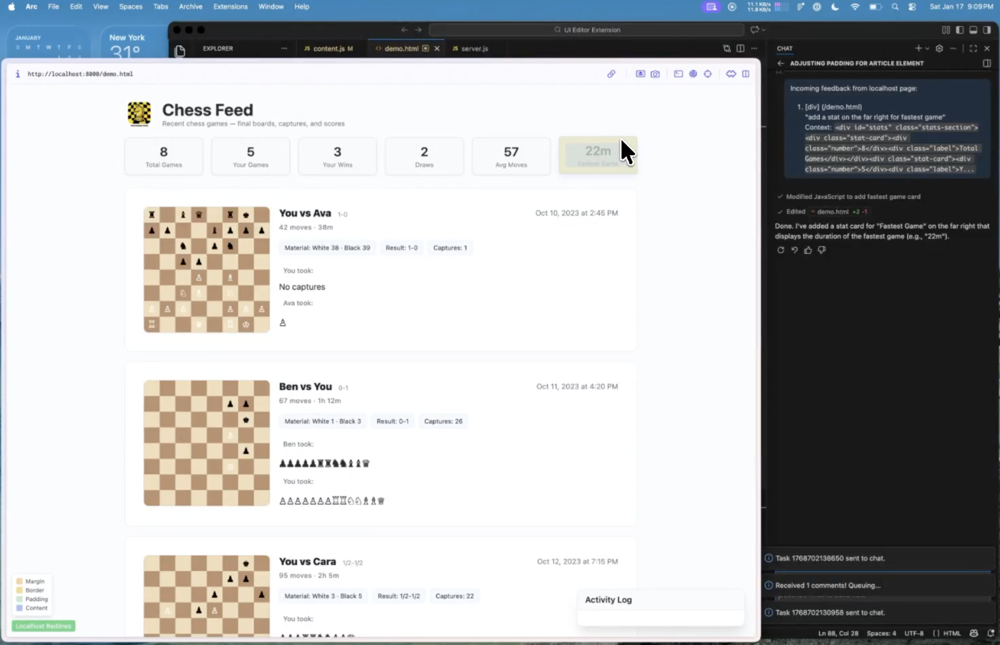
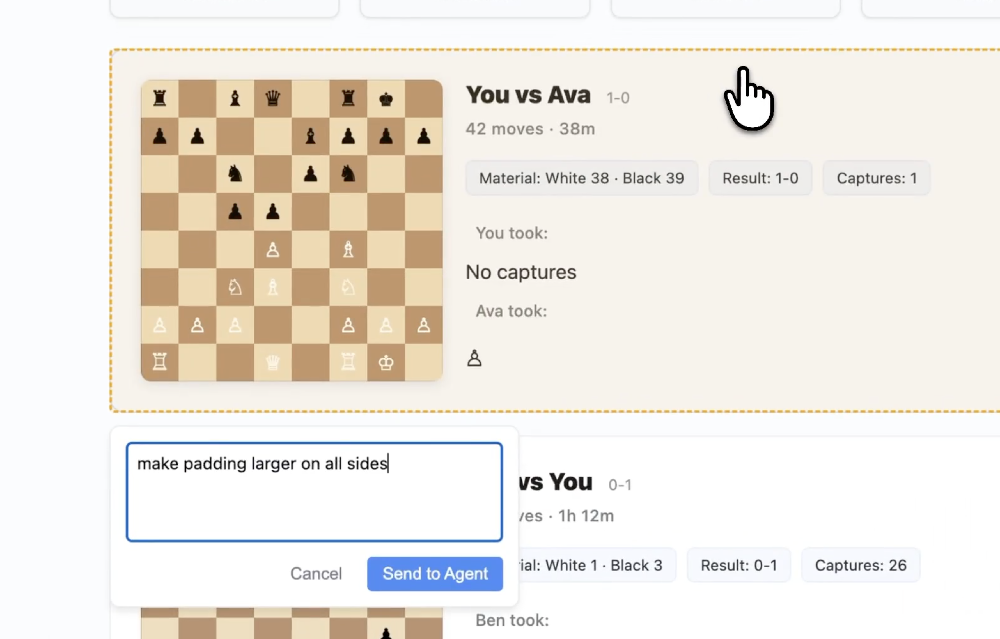
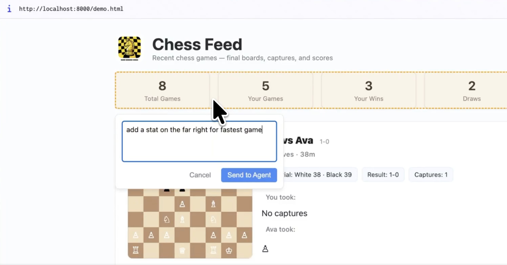

# Localhost Redliner

Mark up your localhost UI with comments and send them straight to your IDE's AI Chat for action.





## How It Works

Localhost Redliner has two parts that work together:

1. **Chrome Extension** — adds an overlay to any localhost page. Hover to inspect elements (margin, padding, border), click to attach a comment.
2. **VS Code Extension** — runs a local server on port 3001. When comments are submitted from Chrome, they appear in VS Code's Chat panel as prompts for your AI assistant to act on.

The Chrome extension sends comments over HTTP to the VS Code extension. Both must be installed.

## Prerequisites

- [Node.js](https://nodejs.org/) (for building from source)
- Google Chrome
- Visual Studio Code with an AI Chat extension

## Install

### VS Code Extension

Download `localhost-redliner-0.1.0.vsix` from the [Releases](https://github.com/angelaliu22/Localhost-Redlines-Extension/releases) page, then:

1. Open VS Code
2. `Cmd+Shift+P` (or `Ctrl+Shift+P`) → **Extensions: Install from VSIX...**
3. Select the downloaded `.vsix` file

The extension activates automatically and starts listening on port 3001.

### Chrome Extension

1. Download and unzip `chrome-extension-prototype.zip` from the [Releases](https://github.com/angelaliu22/Localhost-Redlines-Extension/releases) page
2. Open `chrome://extensions` in Chrome
3. Enable **Developer mode** (toggle in the top right)
4. Click **Load unpacked** → select the unzipped folder

## Usage

1. Make sure VS Code is open (the extension starts automatically)
2. Open any `localhost` or `127.0.0.1` page in Chrome
3. Hover over elements to see box model details (margin, border, padding)
4. Click an element to open a comment box
5. Type your comment and hit Enter
6. The comment appears in VS Code's Chat panel, ready for your AI assistant to act on

## Building from Source

```bash
npm install
npm run compile
npx @vscode/vsce package
```

This produces a `localhost-redliner-<version>.vsix` file you can install or share.

## Troubleshooting

- **Comments not arriving in VS Code?** Make sure VS Code is open, then check that `http://localhost:3001/api/status` returns a response in your browser
- **Port 3001 already in use?** Another process is using the port — stop it, then reload VS Code
- **Overlay not appearing on your localhost page?** Refresh the page. The Chrome extension activates on `localhost` and `127.0.0.1` URLs

## License

MIT
